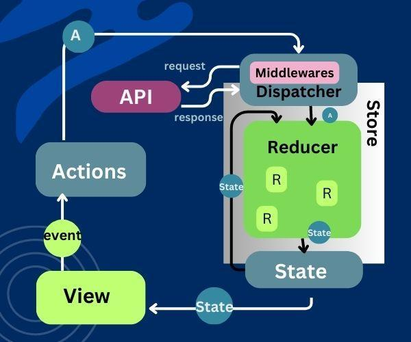

# Redux(Global state container) Architecture

There are three fundamental principles that drive the design of the Redux Architecture:

- Single source of truth
- State is read-only
- Changes are made with pure functions

## Single source of truth

The global state of your application is stored in an object tree within a single store. In simple this means that all of the state is stored within a single place; named as the “store”.

```
struct Todo {
    let text: String
    let completed: Bool
}

struct AppState {
    var todos: [Todo]
}

class AppStore: ObservableObject {
    @Published private(set) var state: AppState
    
    init(initialState: AppState) {
        self.state = initialState
    }
}
```

## State is read-only

In the previous example the owner of AppStore instance can only read the state; the access modifier was private(set) for the state property.

> The only way to change the state is to emit an action, an object describing what happened.

```
enum Action {
    case didSelectItem(Todo)
}

class AppStore: ObservableObject {
    @Published private(set) var state: AppState
    
    init(initialState: AppState) {
        self.state = initialState
    }
    
    func dispatch(action: Action) {
        // dispatch action.
    }
}
```

Actions are not just user actions, the system can perform actions too. If our app requires to fetch the todo items from web service when the view is loaded or appeared then we could have a getTodo action.

```
enum Action {
    case getTodos
    case didSelectItem(Todo)
}
```

> These actions are not actually modifying the state. It is done by pure functions.

## Changes are made with pure functions

A function is called a pure function:

- The output of a pure function depends solely on its input arguments. Given the same input, a pure function will always produce the same output.
- A pure function does not affected by or depends on any external state or data outside of its input arguments.

Changes in the redux state can only be performed by pure functions. These are know as `Reducers` in Redux. 

To generate new app state we need to things:

- The current state
- The action performed

```
typealias Reducer = (_ state: AppState, _ action: Action) -> AppState

func appReducer(state: AppState, action: Action) -> AppState {
    var mutableState = state
    switch action {
        case .didSelectItem(let item):
        var mutableItem = item
        mutableItem.completed.toggle()
        let index = mutableState.todos.firstIndex(where: { $0 == item })!
        var items = mutableState.todos
        items[index] = mutableItem
        mutableState.todos = items
    }
}
```

## Redux in SwiftUI




## Middleware

Intercepts the action before it reaches to the reducer.

Used to:
- Perform side effects(API call, logging).
- Modify or delay actions.
- Inject additional data(auth token).

It is used to perform asynchronous calls or execute logic that later dispatches a new action. This new action can then be processed by the Reducer. Subsequently based on the new action the Reducer may modify the state.

```
typealias Middleware = (_ state: AppState, _ action: Action) -> AnyPublisher<Action, Never>?
```

```
enum Action {
    case getTodos
    case didReceiveItems([Todo])
    case didSelectItem(Todo)
}

func appReducer(_ state: AppState, _ action: Action) -> AppState {
    var mutableState = state
    switch action {
    case getTodos:
        break // do nothing
    case didReceiveItems(let items):
        mutableState.items = items
    case .didSelectItem(let item):
        var mutableItem = item
        mutableItem.completed.toggle()
        let index = mutableState.todos.firstIndex(where: { $0 == item })!
        var items = mutableState.todos
        items[index] = mutableItem
        mutableState.todos = items
    }
    return mutableState
}

func fetchTodosMiddleware(state: AppState, action: Action) -> AnyPublisher<Action, Never>? {
    guard Action.getTodos == action else { return nil }
    // Fetch todos
    // Stub response below
    let items = [Todo(text: "Learn about Redux Architecture in SwiftUI", completed: false)]
    return Just(.didReceiveItems(items))
        .eraseToAnyPublisher()
}

class AppStore {
    @Published private(set) var state: AppState
    
    private let reducer: Reducer
    private let middlewares: [Middleware]

    private var subscriptions: Set<AnyCancellable> = []

    init(initialState: AppState,
         reducer: @escaping Reducer,
         middlewares: [Middleware]) {
        self.state = initialState
        self.reducer = reducer
        self.middlewares = middlewares
    }

    func dispatch(action: Action) {
        for middleware in middlewares {
            let publisher = middleware(self.state, action)
            publisher
                .receive(on: DispatchQueue.main)
                .sink(receiveValue: dispatch)
                .store(in: &subscriptions)
        }
        self.state = self.reducer(self.state, action)
    }
}
```
> Middlewares are intended to intercept actions and execute upon these actions before the state may be modified by the Reducer.
